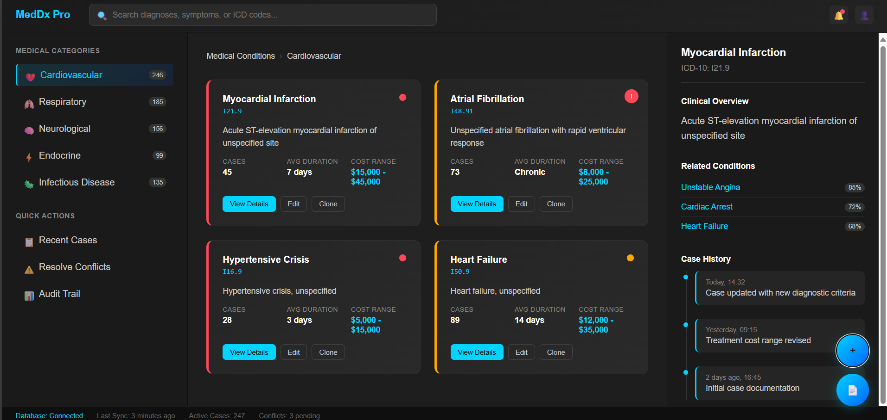
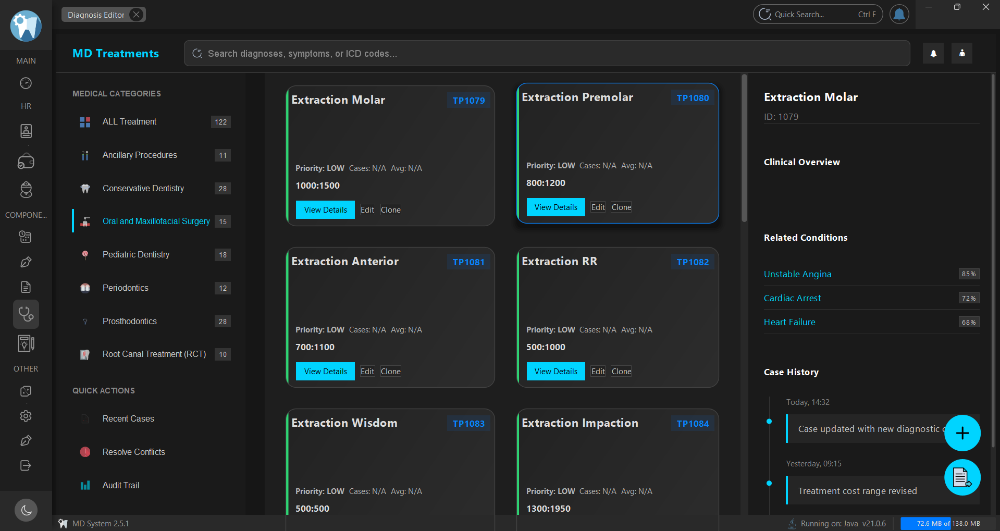

# 🏥 Medical Surgeries Form — Desktop UI Prototype

This project showcases a **clean HTML, CSS, and JavaScript prototype** designed specifically to simulate a desktop user interface for managing **medical surgeries forms**.

The design served as a foundation for building the same form natively with **Java Swing**, using **FlatLaf** and **MigLayout**, and is now **fully integrated within MD System 2.5.1**, our medical desktop management software.

---

## 💡 Why This Prototype?

Designing complex forms directly in Java Swing can be tedious. This web-based prototype allowed for:

✔️ Rapid visual prototyping  
✔️ Iterative layout testing  
✔️ Clear structure aligned with desktop application requirements  

Once finalized, the design was converted into a native Swing form with precise attention to detail.

---

## 🚀 Integration in MD System 2.5.1

The final Java Swing version of this form is part of **MD System 2.5.1**, a complete medical desktop system for clinics and healthcare providers.

In **MD System**, this form is used for recording and managing patient surgeries with:

✔️ Desktop-optimized layout  
✔️ Fast, responsive interaction  
✔️ Fully integrated with the system's database and workflows  

> **Note:** The Java Swing source code is not provided in this repository. This project only includes the HTML prototype used during the design phase.

---

## 📸 Screenshots

| Web Design Prototype | Final Swing Form in MD System 2.5.1 |
|----------------------|-------------------------------------|
|  |  |

---

## 💻 Technologies Used

- **HTML5**  
- **CSS3**  
- **Vanilla JavaScript**  
- **Final form in MD System:** Java Swing, FlatLaf, MigLayout  

---

## 📂 Project Structure

